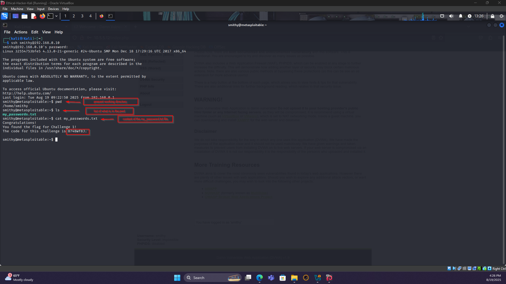
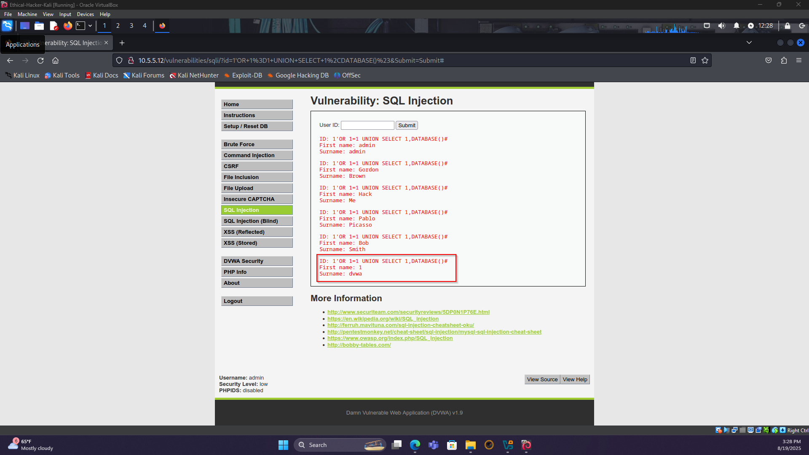
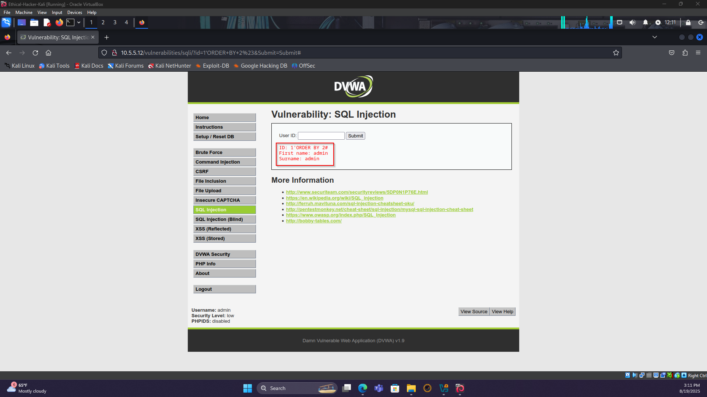
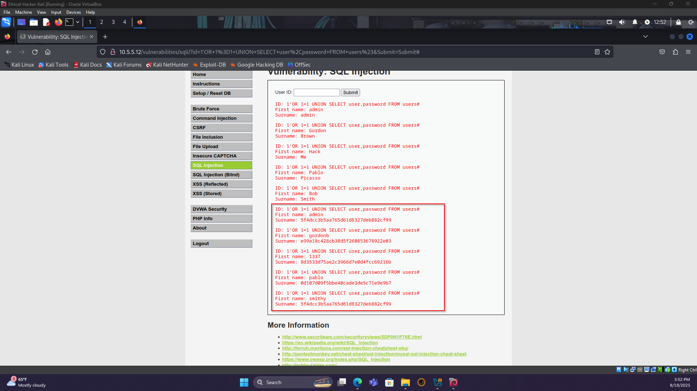
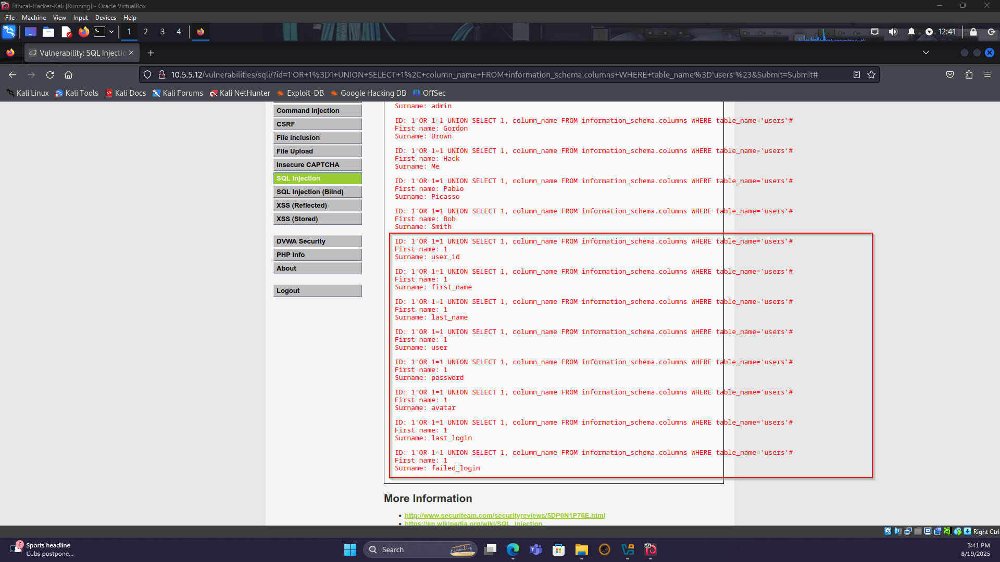
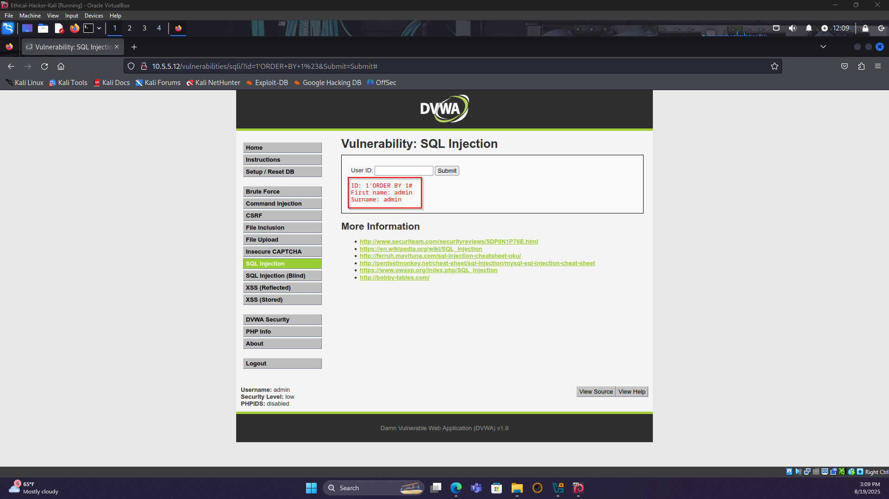
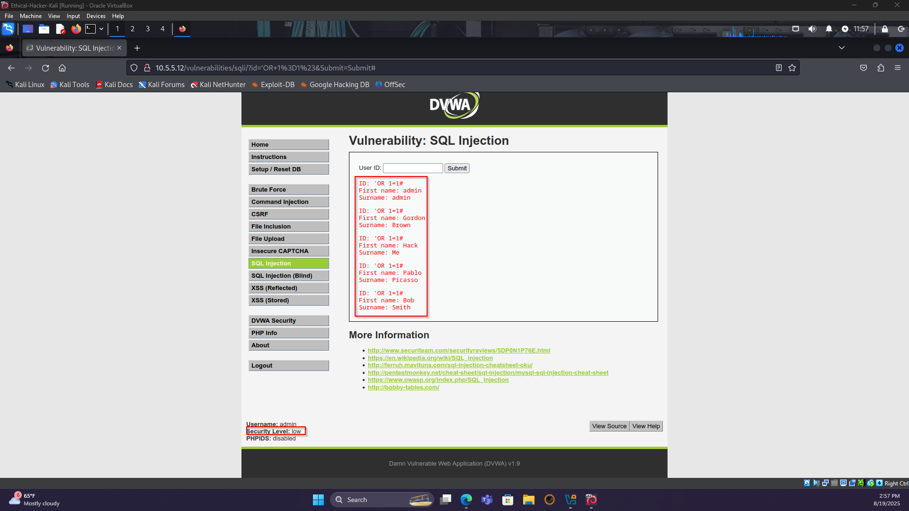
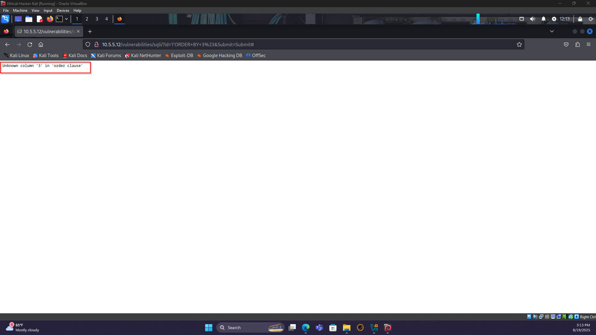

# Challenge 1: SQL Injection

## Objective
Exploit an SQL injection vulnerability on the DVWA server at `10.5.5.12` to retrieve Bob Smith's credentials, crack his password, and access the flag file on `192.168.0.10`.

## Step 1: Preliminary Setup
1. Open a browser and navigate to `http://10.5.5.12` (remove `https://` if needed).
2. Log in with credentials: `admin` / `password`.
3. Set DVWA security level to **Low** and click Submit.

## Step 2: Retrieve Bob Smith's Credentials
- [SQL Commands](./code.sql)
1. **Check for SQL Vulnerability**:
   - Navigate to the SQL Injection tab.
   - In the User ID field, enter: `' OR 1=1 #`
   - **Output**: Displays all user data, confirming SQL injection vulnerability.
   - Screenshot: 
...
- Screenshot: 
- Screenshot: 
- Screenshot: 
- Screenshot: 
- Screenshot: 
- Screenshot: 
- Screenshot: 
- Screenshot: 