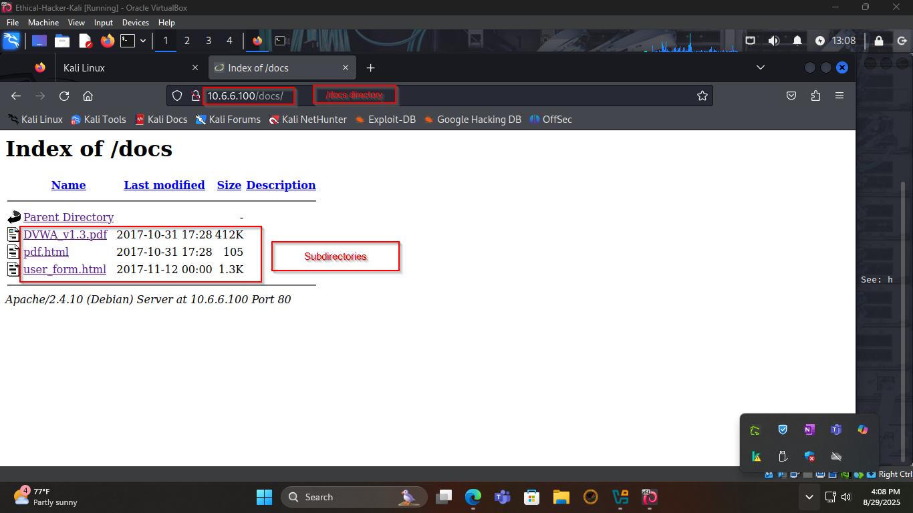
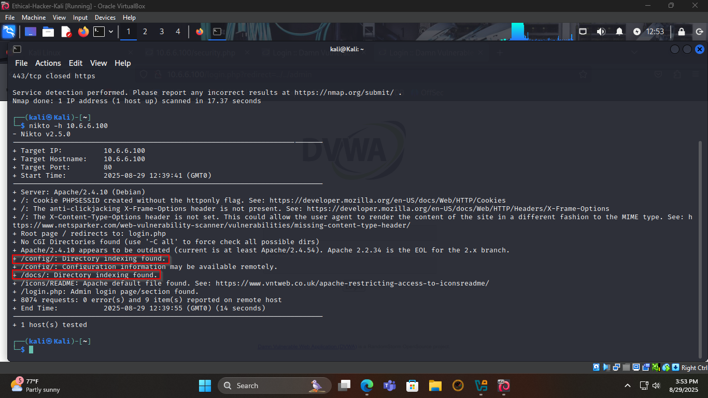
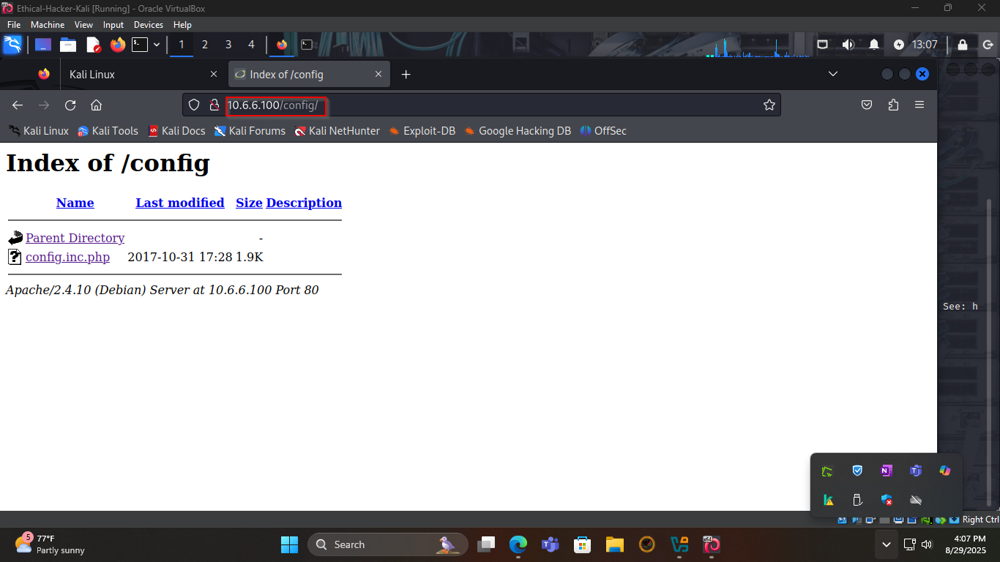
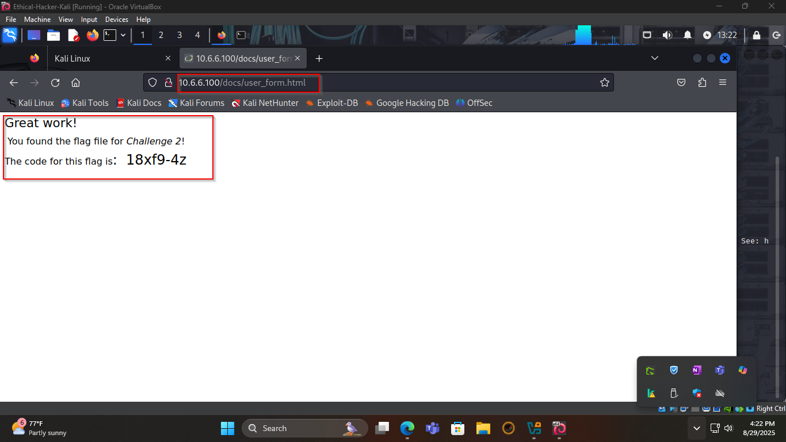

# Challenge 2: Web Server Vulnerabilities

## Objective
Identify and exploit web server vulnerabilities, such as directory listing, to locate a flag file on an HTTP server. This challenge involves performing reconnaissance to find vulnerable directories and accessing a file containing the challenge flag.

**Total Points**: 25

## Tools Used
- **Nikto**: For web server vulnerability scanning and directory enumeration.
- **Python Script (exploit-script.py)**: Custom script for directory enumeration.
- Web browser (for URL manipulation).
- Manual reconnaissance techniques.

## Methodology

### Step 1: Preliminary Setup
1. Logged into the target server (IP redacted for security) using provided credentials.
2. Set the application security level to low to simulate a vulnerable environment.
- Login screenshot:

### Step 2: Reconnaissance
- Used Nikto to scan the target server for vulnerabilities and misconfigurations (command example: `nikto -h http://[target-ip]`).
- Ran `exploit-script.py` to enumerate directories and confirm findings (see script in `exploit-script.py`).
- Identified directories with enabled directory listing through Nikto’s output, script results, and manual URL manipulation in a web browser.
- Viewable directories found:
  - `/config/`
  - `/docs/`
- Nikto scan results screenshot:
  
- Config directory listing screenshot:
  
- Docs directory listing screenshot:
  

### Step 3: Locate the Flag File
- Navigated to the viewable directories using URLs in the web browser.
- Explored subdirectories:
  - `/docs/pdf.html`
  - `/docs/user_form.html`
- Located the flag file: `user_form.html`
- Subdirectory containing the flag: `/docs/user_form.html`
- Flag message: *Great work! You found the flag file for Challenge 2!*
- Flag code: [Redacted for security]
- Flag file screenshot:
  

### Step 4: Remediation Research
To prevent directory listing exploits, the following remediation methods are recommended:
1. **Disable Directory Listing in Web Server Configuration**:
   - For Apache: Add `Options -Indexes` to `httpd.conf` or `.htaccess`.
   - For Nginx: Set `autoindex off;` in the server block configuration.
   - This prevents the server from displaying file lists when no index file is present.
2. **Use Index Files or Restrict Access**:
   - Place a default index file (e.g., `index.html` or `index.php`) in every directory to block directory listing.
   - Alternatively, restrict access to sensitive directories using access control rules (e.g., Apache’s `.htaccess` with `Deny from all` or authentication requirements).

## Lessons Learned
- Nikto and custom scripts like `exploit-script.py` are effective for identifying web server misconfigurations.
- Combining automated tools with manual URL manipulation enhances reconnaissance accuracy.
- Proper server configuration and access controls are critical to secure web servers.

## Repository Notes
- Screenshots (`nikto-scan.png`, `config-dir.png`, `docs-dir.png`, `flag-file.png`) are stored in the `screenshots/` folder, illustrating Nikto scan results, directory listings for `/config/` and `/docs/`, and the flag file `user_form.html`.
- The `exploit-script.py` file contains a sample script for directory enumeration.
- Ensure sensitive data (e.g., IPs, credentials, flags) is redacted before committing to a public repository.
