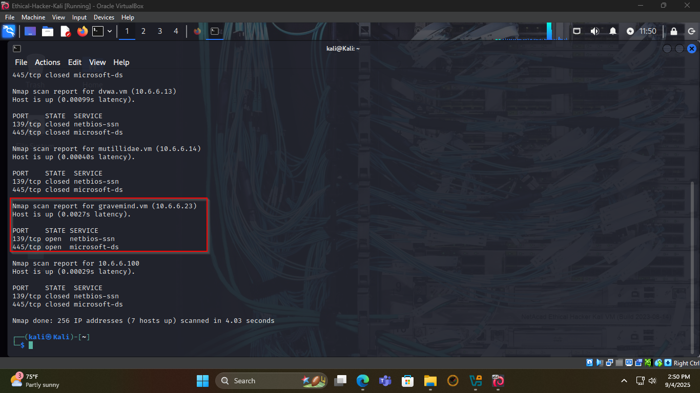
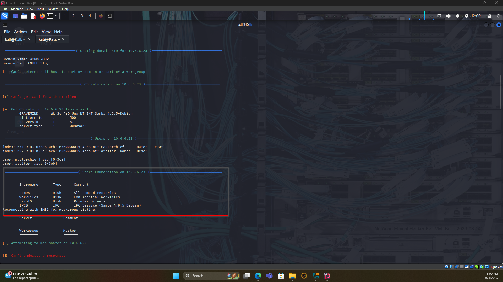
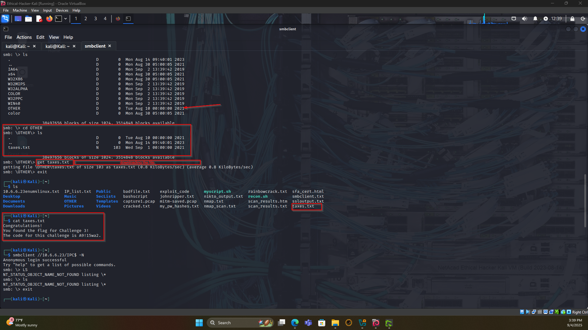

Cisco Ethical Hacker Capstone Project: Challenge 3 - Exploiting Open SMB Server Shares
📋 Background
This repository documents Challenge 3 of the Cisco Ethical Hacker Capstone Project, part of the Cisco Networking Academy's Ethical Hacker course. The challenge involves exploiting open SMB (Server Message Block) shares to retrieve a flag file on a target system within the 10.6.6.0/24 network. The Damn Vulnerable Web Application (DVWA) environment provides a controlled setting to practice ethical hacking techniques.
🎯 Scenario
As a penetration tester, you are tasked with conducting a security assessment for a client. Your goal is to identify vulnerabilities, exploit them, and provide a detailed report with remediation steps. In Challenge 3, you must locate and exploit unsecured SMB shares on a server in the 10.6.6.0/24 network to retrieve a flag file.
🏆 Objective

Challenge 3: Exploit open SMB shares to locate and retrieve the flag file (taxes.txt) containing the code A9!15wa2.Total Points: 25

🛠️ Tools Used

Kali Linux: A penetration testing Linux distribution.
Nmap: Network scanning tool to identify SMB services.
smbclient: Command-line tool for interacting with SMB shares.
Metasploit (optional): For advanced enumeration or exploitation.

🚀 Steps to Complete Challenge 3
Step 1: Reconnaissance

Scan the Network:
Use Nmap to scan the 10.6.6.0/24 network for hosts with open SMB ports (typically 445).
Command:nmap -p 445 10.6.6.0/24 --open

Result: Host 10.6.6.23 has open ports indicating SMB services.
Screenshot:

Step 2: Enumerate SMB Shares

List Available Shares:
Use smbclient to enumerate shares on the target host (10.6.6.23) with anonymous access.

Command:
smbclient -L //10.6.6.23 -N

-L: Lists available shares.
-N: Attempts anonymous login (no credentials).

Result: The SMB server lists the following shares:

Accessible Share: The print$ share allows anonymous access without a valid user login.

Screenshot:

Step 3: Investigate Shares and Retrieve the Flag

Connect to the Share:

Connect to the print$ share using smbclient with anonymous access.
Command:smbclient //10.6.6.23/print$ -N

Note: Anonymous access (-N) is sufficient, as the share allows guest access.
Screenshot:

Navigate the Share:

Use commands like ls or dir to list files and subdirectories.
Command:ls

Result: The file taxes.txt is found in the print$ share.
Screenshot:

Download the Flag File:

Download the taxes.txt file to the local system.
Command:get taxes.txt

Open the file locally to retrieve the flag code.
Command:cat taxes.txt

Result: The file contains the Challenge 3 code: A9!15wa2.
Screenshot:

Step 4: Document Findings

Summary:
Target Host: 10.6.6.23
Vulnerable Share: print$
Access Method: Anonymous login (no credentials required)
Flag File: taxes.txt
Flag Code: A9!15wa2

Visual Evidence: The screenshots are included in the penetration test report to demonstrate each step.

⚠️ Vulnerabilities Discovered

Open SMB Share: The print$ share on 10.6.6.23 allows anonymous access, exposing sensitive files like taxes.txt.
Lack of Authentication: No credentials are required to access the print$ share, indicating a critical misconfiguration.
Inadequate Access Controls: Sensitive data in the share is accessible to unauthorized users.

🛡️ Remediation Recommendations

Restrict SMB Share Access:

Disable anonymous access in smb.conf by setting:guest ok = no

Ensure only authorized users can access shares.

Enforce Strong Authentication:

Disable guest and anonymous logins:map to guest = never

Require strong, unique passwords for all SMB accounts.

Implement Least Privilege:

Restrict file and directory permissions to authorized users only.
Use access control lists (ACLs) to limit read/write access.

Network Segmentation:

Restrict SMB traffic (port 445) to trusted networks using firewall rules.
Block external access to SMB services unless necessary.

Regular Auditing and Monitoring:

Scan for open shares periodically with Nmap.
Monitor Samba logs for unauthorized access attempts.

Patch and Update:

Update Samba (version 4.9.5-Debian) to the latest version.
Apply security patches promptly to mitigate known vulnerabilities.

✅ Conclusion
Challenge 3 demonstrates the dangers of misconfigured SMB shares, which can expose sensitive data to unauthorized users. By exploiting the print$ share on 10.6.6.23, we retrieved the taxes.txt file containing the flag code A9!15wa2. The remediation steps provided will help secure SMB servers, emphasizing authentication, access controls, and network security.
📚 References

Cisco Ethical Hacker Course
DVWA Documentation
Samba Documentation
Nmap Documentation
smbclient Manual
